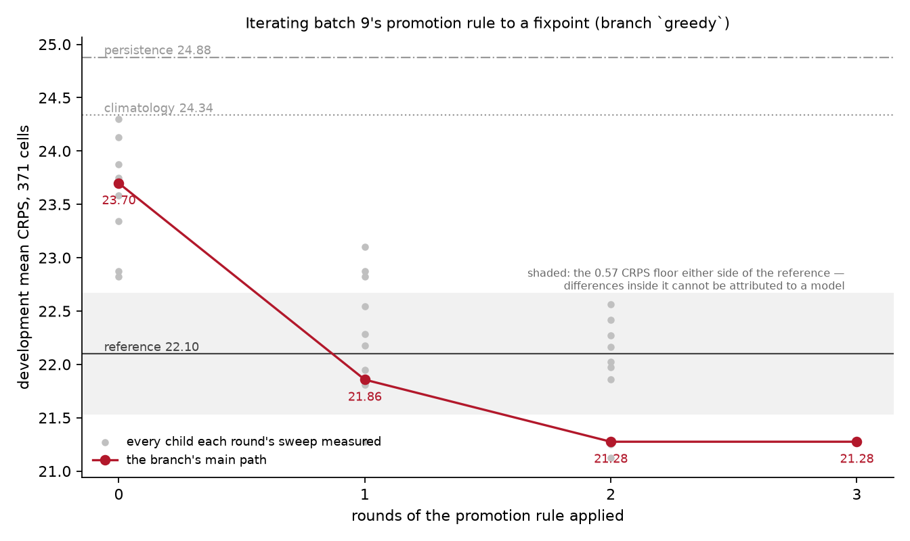

# Batch 21 — the greedy branch: iterating the promotion rule to a fixpoint

Generated from [[26-08-22_dengueForecastingCase]] — iteration 21

**Branch `greedy` · Status: done — produced · Executed 2026-08-27**

---

**Nothing in this report is a reported result of the project.** It was produced on a branch
named `greedy` that is never merged, and the analysis this repository reports is the one on
`main`, where batch 9's promotion rule is applied once and stops. This batch answers a
question the human asked about that decision: where would iterating have taken us?

It took three rounds and it went **past the reference model**. Development mean CRPS falls
from 23.698 to **21.275**, the skill score from −0.072 to **+0.037**, and the candidate ends
ahead of `chapkit_ewars_model` and of each of its four repeats individually.

And the comparison still cannot separate the two models. The paired per-cell difference is
−0.823 CRPS with a split-clustered standard error of **1.602** — half a standard error, on a
backtest that resolves about 4. **Both halves of that are the result**; the first without the
second would be the attractive half of something the data does not support.

## 1. Why this branch exists

Batch 9 fixed a promotion rule, applied it once, and stopped. Its §13 put the decision to
the human with the cost attached: two children were outside the 0.57 CRPS floor from where
the model then stood, and taking them would have been worth roughly 0.9 CRPS. The reason for
stopping was that iterating is greedy coordinate descent on development CRPS — the failure
the plan's phase C names — and that one held-out year cannot diagnose it.

The human settled it both ways (plan §4b, 2026-08-27): the main path does **not** iterate,
and the iterated path is run on a branch so that what stopping cost is measured rather than
estimated from one sweep.

## 2. The rule, fixed before it decided anything

`AI-generated/candidate-forks/greedy/greedy_rule.md` is batch 9's promotion rule with one
clause removed — the clause that said "applied once" — and one added: a round cap of 8, as
the budget line `AGENTS.md` §6 asks to be drawn in advance. Everything else is identical on
purpose, so that what the branch measures is the effect of *iterating*, not the effect of
iterating a different rule. It was committed at `cb61c1d`, before the first round it decided
was run.

**The rule is executed by code, not by a reading of a table.**
`AI-internal/useful-scripts/greedy_iterate.py` reads each round's leaderboard, writes down
which forks it moves and why — and which it leaves, with their margins — and only then
touches the tree. No number crosses from a sweep to a promotion through anyone's attention.

Round 1's sweep was **reused, not re-run**: batch 9's second sweep was taken around exactly
the configuration the branch starts from, and the driver checks that recorded configuration
hash against the tree before believing it.

## 3. Three rounds, and then nothing moved

| after round | what the rule moved | mean CRPS | gain | one at a time predicted |
|---|---|---|---|---|
| 0 | — (batch 9's promoted candidate) | 23.698 | | |
| 1 | `02_covariates` → `b_rich`, `04_fitTime` → `b_refitAtPredict` | **21.857** | **1.841** | 1.694 |
| 2 | `05_autoregressive` → `b_lag3` | **21.275** | **0.582** | 0.582 |
| 3 | nothing clears the floor | 21.275 | — | — |



**The fixpoint is real, not a budget line.** Round 3 ran a full sweep and found the best
remaining move worth **0.150** CRPS — dropping the population offset — which is a quarter of
the floor and a fortieth of what the backtest can resolve. The cap of 8 rounds was never
approached.

**What each fork is worth at the fixpoint**, from `round03/fork_leaderboard.csv`, as the cost
of reverting it:

| fork | reverting to | costs |
|---|---|---|
| `04_fitTime` | `a_trainOnly` | **1.285** |
| `06_yearVariance` | `a_shared` | 0.888 |
| `02_covariates` | `a_lagged` | 0.752 |
| `01_observation` | `a_negBinomial` | 1.143 (`b_zeroInflated`: 0.697) |
| `05_autoregressive` | `a_none` | 0.582 |
| `03_population` | `c_ignored` | **−0.150** (an improvement, inside the floor) |

## 4. What the greedy model is

```
log mean = log(population)                      offset
         + global level
         + shared annual season, two harmonics
         + rainfall, mean temperature, mean relative humidity, each at lags 1, 2 and 3
         + log1p of the count three months back
         + province effect      u[i]    ~ pooled, sigma_u
         + province-year effect v[i,y]  ~ pooled, sigma_v[i]     one variance per province
observation: two-part hurdle, refitted inside every predict call
```

Configuration `8e021eaf2d1e3751…`, against the main line's `28c7c617d5c26fa0…`. Same seed,
same model code, same dataset file byte for byte; four of the six forks differ.

**It costs 91 seconds a backtest against the main line's 36** — eight fits instead of one —
and **it has no fitted object**. §6 is about that.

## 5. What it scores

`04_score/03_compare/results/main/leaderboard.csv` on the branch:

| model | mean CRPS | MAE | 10–90 | 25–75 | cost |
|---|---|---|---|---|---|
| **hier_nb (greedy)** | **21.275** | **26.278** | 0.741 | 0.582 | 91 s |
| reference repeat 4 | 21.820 | 28.627 | 0.817 | 0.609 | |
| reference repeat 1 | 21.917 | 28.557 | 0.809 | 0.606 | |
| reference (mean of 4) | 22.098 | 28.902 | 0.804 | 0.602 | 1 070 s |
| reference repeat 2 | 22.272 | 29.465 | 0.809 | 0.598 | |
| reference repeat 3 | 22.385 | 28.960 | 0.782 | 0.596 | |
| climatology | 24.337 | 30.620 | 0.650 | 0.542 | 28 s |
| persistence | 24.879 | 29.073 | 0.666 | 0.491 | 31 s |

It is first on the board, ahead of every individual repeat of the reference and not only of
their mean. Coverage improved as well as score — 0.741 at 10–90 against the main line's
0.701, nominal 0.80 — which is not what the earlier rounds of this project produced, where
score and calibration moved against each other.

**By lead time** the greedy model is **17.97 / 20.41 / 25.44** against the reference's 16.54
/ 21.97 / 27.79. It now wins at two and three months and loses at one, where the whole
remaining gap is. The main line's candidate was 20.4 / 23.2 / 27.5 and won at none.

**And the backtest cannot separate it from the reference.** −0.823 CRPS paired, standard
error 1.602 clustered by split, **0.51 standard errors**; **50.4 %** of cells and 3 of 8
splits. Batch 9's candidate was 1.03 standard errors on the other side. Moving from "1.03
standard errors behind" to "0.51 ahead" is a real movement in the mean and no movement at
all in what can be concluded.

**By province**, against the reference: Vientiane Capital **65.2** against 92.8 (it was 78.0
on the main line), Champasak 47.6 against 52.2, Luang Prabang 41.4 against 47.4 — and
Salavan **47.4 against 38.4**, with 10–90 coverage 0.21 against a nominal 0.80. Salavan was
where batch 9 said the remaining gap lived, and two rounds of selection did not touch it.
The gain came from the provinces the model was already winning.

## 6. What the selection bought and what it cost

**The forks do not add — and this branch shows the sign running the other way.** Batch 9
found three forks worth 4.632 CRPS separately delivering 2.402 together. Here round 1's two
forks were worth 1.694 separately and delivered **1.841**, and the clearer case is
`05_autoregressive`:

| the lagged-count term, measured around | worth |
|---|---|
| batch 8's defaults | **−0.075** |
| batch 9's promoted path (the main line) | +0.353 |
| the greedy branch after round 1 | **+0.582** |

Batch 9 concluded that a three-month lagged count is worth nothing on this dataset, and that
was true where it was measured. What round 1 changed is that the model now refits inside
every `predict` call, so at each split the lagged-count column is filled from history the
train-time fit never saw. The autoregressive term and the refit are complements; neither
alone shows it. **A one-at-a-time sweep cannot see a complement**, and this is the second
independent demonstration of that in two batches. Tier 2 of the phase-D manifest should not
be cut.

**The record lost its fitted model.** The first fork the rule moved was `04_fitTime`, and
under `fit_time = predict` the fit happens once per split inside chap-core's untracked run
directories. `a_hierNB/results/main/fitted_model.json` on this branch is **520 bytes** — the
configuration, the training window, and the sentence "not fitted here". No coefficients, no
seventeen annual variances, no EM history. The main line's is 6 400 lines.

That is the most useful thing this branch produced. **A rule that selects on development
CRPS is indifferent to whether the model it selects can be inspected**, and there is no
threshold on the score that would have noticed. `/annotate-criticality` records it as an
artifact whose transparency value is "highest, and empty".

**And the branch's own record is thinner than the main line's.** The loop ran unattended
between one commit and the next, so the tree's main-path markers moved twice inside a single
commit and round 2's per-combination results were replaced by round 3 before any commit held
them. Batch 9 committed each promotion separately, which is why round 1's files are
recoverable at `49825b5` and round 2's here are not. What survives is the round records, the
leaderboards and the sweep logs — enough to say what was decided and why, and not enough to
re-open the files without re-running the branch.

## 7. Decisions taken in this batch

| Decision | Basis | Agency |
|---|---|---|
| The iterated path runs on a branch that is never merged | The human's, on batch 9's open question. The reported analysis is the one that stopped, and the branch measures what stopping cost | human-set |
| The rule is batch 9's with the single-application clause removed and nothing else changed | What the branch measures should be the effect of iterating, not of a different rule. Committed before the first round it decided was run | agent-autonomous |
| A round cap of 8, stated in advance | `AGENTS.md` §6 asks for the budget line to be drawn before the work rather than after. It was never approached, and the report says so | agent-autonomous |
| Round 1 selects on batch 9's second sweep rather than re-running it | It was taken around exactly this base, our models are seeded and their determinism is verified, and the driver checks the recorded configuration hash before believing the table | agent-autonomous |
| The loop promotes and runs unattended, without a commit per round | The cost is stated in §6 and is real: round 2's per-combination results are not recoverable from git. Taken because a rule executed by a script cannot be fitted to what it decides in the way a hand-run loop can | agent-autonomous |
| The reference and the baselines are never re-run | Nothing this branch moves changes what they face, and the reference is unseeded: re-running it would move the denominator of every comparison for reasons unrelated to the branch | agent-autonomous |
| The holdout is not opened | Not on this branch and not on any other. The one opening the project has belongs to phase E and to the frozen manifest, and spending it here would answer this branch's question by destroying the project's | agent-autonomous |

## 8. Compliance for this batch

- **Rule 1** — every number in this report is read from a file an executed script wrote. The
  rule's own decisions are in `round_NN.json`, written before each round touched the tree.
- **Rule 2** — nothing produced was edited. Six result directories were *removed* when their
  forks moved, for batch 9's reason: a specification file records the combination it was
  produced under, so a renamed directory would contradict its own contents.
- **Rule 3** — unchanged. All twenty backtests verified after the fact that the lockfile
  chap-core built from is byte-identical to the tracked one.
- **Rule 4** — three commits: the ledger and the human's decision (on `main`), the rule and
  the driver before the run, and this one after it. The gap is §6's: no commit per round.
- **Rule 5** — intermediates stored as everywhere else, **with one hole that is the batch's
  main finding**: the selected model has no fitted object at all. Stated, not worked around.
- **Rule 6** — the component seed is unchanged at **849487747**. Two independent runs of the
  greedy model under scratch combinations produce **identical per-cell scores**. See §9 for
  what the check's own status field says and why.
- **Rule 7** — the three figures at `04_score/03_compare` regenerated over the greedy model,
  each with its plotted and pre-aggregation values; and `greedy_trajectory.png` with
  `greedy_trajectory.csv` (the line) and `greedy_trajectory_children.csv` (every child every
  round measured) beside it.
- **Rules 8, 9, 10** — no surface here, and none intended: this branch feeds no claim.
- **`/annotate-criticality`** — appended to `analysis/03_models/criticality.md`.
- **`/validate invariants`** — passes: tree, provenance, plots, seeds, claims, git, crossing.

## 9. What went wrong, kept

**The determinism check has been reporting `differs` since before this batch, and batch 9's
report cites it as `identical`.** Running it here produced a file byte-identical to the one
committed in batch 9, whose top-level `status` is **`differs`** and whose three models each
carry `identical: false` with `differing_files: models.csv`.

The cause is not in the models. `models.csv` carries a `scored_under_combo` column, and the
check compares the two runs' copies of it — under scratch combinations named
`determinism_<model>_1` and `_2`, so a column whose value is *defined* to differ between the
two runs. `metrics_cell.csv` and `fitted_model.json` match in every case, which is what
batch 9's sentence about "identical per-cell scores and identical fitted objects" actually
claims and what is actually true. The parenthetical citation of the file's status is wrong.

The check is over-strict rather than the models being non-deterministic, so `AGENTS.md` §5's
"fix the cause, never adjust the check" does not have an obvious target: the cause is that
the check compares an artifact that records which combination produced it. **Nothing was
changed here** — it is main-line machinery and this is a branch — and it is §11's first item
for the human.

**The greedy model's fitted-object comparison is vacuous.** With `fit_time = predict` the
fitted object is a stub, so the check compares two stubs and finds them equal. Rule 6 is
satisfied by the per-cell scores; the strongest part of the check does not apply to the model
this branch selected, which is another way of saying §6's finding.

**Round 2's per-combination results are not in git.** §6.

## 10. What is still unknown

1. **Whether any of the 2.42 CRPS survives a year the model has not seen.** That is the
   question the branch exists to raise and the one it is forbidden to answer. The main line's
   phase E answers it for the model on the main line; nothing answers it for this one unless
   the human decides the branch's model joins the frozen manifest, which would spend part of
   the holdout's single opening on a path the project does not report.
2. **How much of the gain is the refit and how much is the selection.** `b_refitAtPredict`
   alone was worth 0.873 from batch 9's path, and the branch's total is 2.42. The refit is a
   structural correction of a real asymmetry — the reference model refits inside its own
   predict endpoint and ours did not — so part of this branch's gain is a fair fix and part
   is coordinate descent. Nothing here separates them.
3. **What repairs Salavan.** Unchanged from batch 9, and now with two more rounds of evidence
   that no fork in this tree touches it.
4. **Whether the one-month lead can be closed.** 17.97 against 16.54, from 20.4 against
   16.54. Two rounds bought most of the shortfall at the longer leads and a third of it here.

## 11. For the human

- **Iterating the rule would have taken the project past the reference: 21.275 against
  22.098, a skill score of +0.037.** It also would not have changed what the project can
  conclude, because at half a standard error the backtest cannot tell the two models apart in
  either direction. The main line's "we cannot separate these two" survives the branch
  intact, with the sign of the point estimate reversed.
- **The strongest argument against having iterated is not the score, it is the record.** The
  first fork the rule moved is the one that deletes the model's parameters from the
  repository. A greedy rule on a development metric cannot see that, and the branch is the
  demonstration.
- **Your determinism check needs a decision.** It has said `differs` since the
  `scored_under_combo` column was added, for a reason that is not about determinism, and
  batch 9's report cites it as though it said `identical`. The honest repairs are to compare
  `models.csv` with that column excluded, or to drop it from the comparison and say so — both
  are changes to main-line machinery and to a batch report that is already written, so I have
  made neither. §9 has the detail.
- **Tier 2 of the phase-D manifest now has two independent demonstrations behind it**, in
  opposite directions: batch 9's forks that overstated their combined worth, and this
  branch's fork that was worth nothing until another one moved.
