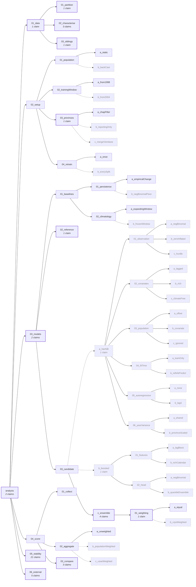

# The claim tree

> **A snapshot, generated 2026-09-27 from the tree at commit `3d89200`.** Everything here is derived from files the repository versions and regenerates in seconds with `.venv/bin/python AI-internal/useful-scripts/build_claim_tree_md.py` (or `/hierarchical-report`). If the tree has changed since that commit, rebuild rather than trust this copy; never hand-edit.

The analysis is a tree of questions. Each node states a **claim** — what it sets out to establish — and the **result** it found, and each child answers part of its parent. 71 nodes; 17 of them are forks between alternatives, where the reported analysis takes the main path and the paths not taken stay in the tree, complete and runnable. 48 claims in the [claim collection](claims.md) rest on the nodes.

**Ways in:** click down from [the root node](analysis/README.md), start from a claim in [the claim collection](claims.md), or use the list below. To descend a reported number to the per-cell scores it averages, build the HTML report (`/hierarchical-report`) and open `AI-generated/hierarchical-report/index.html`.

## The reported conclusion

**ensemble**, skill score 0.1485 against the reference model on the development backtest, 0.0868 on the held-out year. Mean CRPS 18.817 against 22.098, and 76.731 against 84.026 on the holdout.

It is one member of a distribution over the whole perturbation set — see [05_stability](analysis/05_stability/README.md) and the claims that rest on it.

## The tree

Solid arrows are the path the reported analysis takes; dashed boxes are paths not taken. Bold boxes carry claims. The diagram is not clickable — the list below is.

## Every node

- [analysis](analysis/README.md) · [C14](claims.md#c14), [C22](claims.md#c22)  
  Can a spatio-temporal model of monthly dengue case counts across the admin-1 provinces of Laos, developed as autonomously as this setup …
  - [01_data](analysis/01_data/README.md) · [C33](claims.md#c33)  
    What does the Lao admin-1 monthly dengue dataset contain, and on what part of it may development happen? The node separates the held-out …
    - [01_partition](analysis/01_data/01_partition/README.md) · [C35](claims.md#c35)  
      Does the archived source file partition exactly into a development period (1998-01 to 2009-12) and a held-out year (2010), and is each part …
    - [02_characterise](analysis/01_data/02_characterise/README.md) · [C32](claims.md#c32), [C34](claims.md#c34), [C36](claims.md#c36)  
      What is in the development period: how complete is it per province and per year, how are dengue counts distributed, what seasonality do …
    - [03_siblings](analysis/01_data/03_siblings/README.md) · [C46](claims.md#c46)  
      What do the two sibling harmonised datasets — Thailand and Vietnam — contain, and on what arrangement of them can the reported model be …
  - [02_setup](analysis/02_setup/README.md)  
    What dataset and evaluation setting do all models — ours, the baselines and the reference — face in common? Everything decided here moves …
    - [01_population](analysis/02_setup/01_population/README.md)  
      How should the static population figure enter the analysis dataset? The file carries one population number per province for the whole …
      - [a_static](analysis/02_setup/01_population/a_static/README.md) — **main path**  
        Take the archived population column unchanged: one constant per province across the period, as the source file supplies it.
      - [b_backCast](analysis/02_setup/01_population/b_backCast/README.md) — *not taken*  
        Replace the single population snapshot with a per-province, per-year series back-cast from it, so the figure a model divides by is roughly …
    - [02_trainingWindow](analysis/02_setup/02_trainingWindow/README.md)  
      How much of the record should models be allowed to learn from, given that the share of zero-valued months falls monotonically across the …
      - [a_from1998](analysis/02_setup/02_trainingWindow/a_from1998/README.md) — **main path**  
        Use the whole development period, 1998-01 to 2009-12, as the record models learn from.
      - [b_from2004](analysis/02_setup/02_trainingWindow/b_from2004/README.md) — *not taken*  
        Let models learn only from the second half of the development record, 2004-01 onward. The share of zero-valued months falls monotonically …
    - [03_provinces](analysis/02_setup/03_provinces/README.md) · [C18](claims.md#c18)  
      Which provinces belong in the analysis at all? One province reports nothing across the whole record and a second stops reporting partway …
      - [a_chapFilter](analysis/02_setup/03_provinces/a_chapFilter/README.md) — **main path**  
        Leave inclusion to chap-core's own region filter: pass every province in the file and let the platform drop what it will not model.
      - [b_reportingOnly](analysis/02_setup/03_provinces/b_reportingOnly/README.md) — *not taken*  
        Remove the two provinces that cannot be evaluated before the dataset reaches the platform, so they are absent from training as well as from …
      - [c_mergeVientiane](analysis/02_setup/03_provinces/c_mergeVientiane/README.md) — *not taken*  
        Aggregate Vientiane province into Vientiane Capital, which lies geographically inside it, so the province that never reports is not a hole …
    - [04_retrain](analysis/02_setup/04_retrain/README.md)  
      How often is a model refitted across the backtest? Chap's n-retrain governs whether one fit serves all splits or each split gets its own.
      - [a_once](analysis/02_setup/04_retrain/a_once/README.md) — **main path**  
        Refit once, at chap-core's default n-retrain 1: a single fit on the training period, with an expanding historic window handed to predict at …
      - [b_everySplit](analysis/02_setup/04_retrain/b_everySplit/README.md) — *not taken*  
        Refit every model at every split rather than once, by setting chap-core's n-retrain to the number of splits. A forecast made in 2009 is …
  - [03_models](analysis/03_models/README.md) · [C29](claims.md#c29), [C37](claims.md#c37)  
    What forecast does each model make on that common ground? The node holds every model the project scores — our baselines, our candidates and …
    - [01_baselines](analysis/03_models/01_baselines/README.md)  
      How well does the problem's own inertia forecast it? Two baselines the plan requires: what the series did last, and what the series usually …
      - [01_persistence](analysis/03_models/01_baselines/01_persistence/README.md)  
        How well does the last observed count forecast the next three months? A persistence forecast is a point, and CRPS scores a distribution, so …
        - [a_empiricalChange](analysis/03_models/01_baselines/01_persistence/a_empiricalChange/README.md) — **main path**  
          Wrap the point in the empirical distribution of past h-step changes within the same province, each change entered with its negation so the …
        - [b_negBinomialFloor](analysis/03_models/01_baselines/01_persistence/b_negBinomialFloor/README.md) — *not taken*  
          Wrap the persistence point in a negative binomial whose mean is the last observation and whose dispersion is fitted from recent …
      - [02_climatology](analysis/03_models/01_baselines/02_climatology/README.md)  
        How well does the seasonal average forecast the next three months? For each province and calendar month, the empirical distribution of the …
        - [a_expandingWindow](analysis/03_models/01_baselines/02_climatology/a_expandingWindow/README.md) — **main path**  
          Estimate each province's calendar-month distribution from everything observed by the time the forecast is made — the expanding historic …
        - [b_frozenWindow](analysis/03_models/01_baselines/02_climatology/b_frozenWindow/README.md) — *not taken*  
          Estimate each province's calendar-month distribution once, from the training period alone, and hold it fixed across every split rather than …
    - [02_reference](analysis/03_models/02_reference/README.md) · [C24](claims.md#c24)  
      What does the field's own model score on this dataset? WHO EWARS-csd as published at chapkit_ewars_model, at its own default configuration, …
    - [03_candidate](analysis/03_models/03_candidate/README.md)  
      Which model family should our candidate be? Each child is one family — one possible answer to the same question of what forecast our model …
      - [a_hierNB](analysis/03_models/03_candidate/a_hierNB/README.md) — *not taken* · [C27](claims.md#c27)  
        …a hierarchical negative-binomial GLM: monthly province counts as negative-binomial draws around a log-linear mean built from a population …
        - [01_observation](analysis/03_models/03_candidate/a_hierNB/01_observation/README.md)  
          What observation model do the counts get? Monthly province counts on this dataset are heavily over-dispersed and about a third of them are …
          - [a_negBinomial](analysis/03_models/03_candidate/a_hierNB/01_observation/a_negBinomial/README.md) — *not taken*  
            One negative-binomial distribution for every cell, with a single dispersion shared across provinces: the over-dispersion and the zeros are …
          - [b_zeroInflated](analysis/03_models/03_candidate/a_hierNB/01_observation/b_zeroInflated/README.md) — *not taken*  
            A mixture: a share of the zero months come from a process that reports nothing at all, and the rest of the record — zeros included — comes …
          - [c_hurdle](analysis/03_models/03_candidate/a_hierNB/01_observation/c_hurdle/README.md) — **main path**  
            Two processes rather than one distribution: whether a province-month reports any cases at all is a logistic model, and how many it reports …
        - [02_covariates](analysis/03_models/03_candidate/a_hierNB/02_covariates/README.md)  
          Which climate covariates enter the mean, and at which lags? The file carries rainfall, mean temperature and mean relative humidity, and a …
          - [a_lagged](analysis/03_models/03_candidate/a_hierNB/02_covariates/a_lagged/README.md) — *not taken*  
            Rainfall and mean temperature only, each entering linearly at a two-month lag — the covariate pair and the lag the reference model's own …
          - [b_rich](analysis/03_models/03_candidate/a_hierNB/02_covariates/b_rich/README.md) — *not taken*  
            All three climate columns — rainfall, mean temperature and mean relative humidity — each at one, two and three months' lag, letting the fit …
          - [c_climateFree](analysis/03_models/03_candidate/a_hierNB/02_covariates/c_climateFree/README.md) — **main path**  
            No climate covariates at all, so that the shared annual harmonics and the province-year effect alone carry the seasonal cycle. If this …
        - [03_population](analysis/03_models/03_candidate/a_hierNB/03_population/README.md)  
          How does the province population enter the model? The file's population figure is one constant per province, and it can serve as a …
          - [a_offset](analysis/03_models/03_candidate/a_hierNB/03_population/a_offset/README.md) — **main path**  
            As a fixed offset, log population: the model forecasts an incidence rate and multiplies it back up by the province's size, so the fit never …
          - [b_covariate](analysis/03_models/03_candidate/a_hierNB/03_population/b_covariate/README.md) — *not taken*  
            Population as an estimated coefficient on standardised log population rather than as a fixed offset, so the data decides how reported cases …
          - [c_ignored](analysis/03_models/03_candidate/a_hierNB/03_population/c_ignored/README.md) — *not taken*  
            Population does not enter the model at all: a province's level is carried entirely by its own pooled intercept, which is estimated from its …
        - [04_fitTime](analysis/03_models/03_candidate/a_hierNB/04_fitTime/README.md)  
          Does the model do its fitting in train or in predict? Chap fits once and then predicts at every split, so a model that refits inside …
          - [a_trainOnly](analysis/03_models/03_candidate/a_hierNB/04_fitTime/a_trainOnly/README.md) — **main path**  
            Fit once, in train, on the training period Chap supplies; predict applies the stored fit and reads the expanded history only for the …
          - [b_refitAtPredict](analysis/03_models/03_candidate/a_hierNB/04_fitTime/b_refitAtPredict/README.md) — *not taken*  
            The model is refitted inside every predict call, on the whole expanding historic window Chap hands it, so that a forecast late in the …
        - [05_autoregressive](analysis/03_models/03_candidate/a_hierNB/05_autoregressive/README.md)  
          Does the model see the recent case history, or only the calendar and the weather? A seasonal regression forecasts the average year; the …
          - [a_none](analysis/03_models/03_candidate/a_hierNB/05_autoregressive/a_none/README.md) — **main path**  
            No autoregressive term. The forecast for a province-month is built from the calendar, the climate and the province's own level and annual …
          - [b_lag3](analysis/03_models/03_candidate/a_hierNB/05_autoregressive/b_lag3/README.md) — *not taken*  
            The count three months back enters the linear predictor as standardised log1p. Three is the shortest lag one model can use at all three of …
        - [06_yearVariance](analysis/03_models/03_candidate/a_hierNB/06_yearVariance/README.md)  
          Is the year-to-year variability of dengue the same relative size in every province? The province-year effect's variance sets how wide every …
          - [a_shared](analysis/03_models/03_candidate/a_hierNB/06_yearVariance/a_shared/README.md) — *not taken*  
            One province-year variance for the whole country, estimated by pooling every province's annual effects. Every province's forecast is then …
          - [b_provinceScaled](analysis/03_models/03_candidate/a_hierNB/06_yearVariance/b_provinceScaled/README.md) — **main path**  
            One province-year variance per province, estimated from that province's own annual effects, so a province whose epidemic years swing hard …
      - [b_boosted](analysis/03_models/03_candidate/b_boosted/README.md) — *not taken* · [C28](claims.md#c28)  
        …gradient-boosted trees with a probabilistic head: the conditional distribution of a province-month's count built in two pieces, a …
        - [01_features](analysis/03_models/03_candidate/b_boosted/01_features/README.md)  
          Which features does the booster see? Trees cannot extrapolate a trend or interpolate a cycle, so what a boosted model knows about time and …
          - [a_lagBlock](analysis/03_models/03_candidate/b_boosted/01_features/a_lagBlock/README.md) — **main path**  
            A block of lags and nothing else: the climate columns at the lags a three-month forecast can see, the province's own recent counts at the …
          - [b_richCalendar](analysis/03_models/03_candidate/b_boosted/01_features/b_richCalendar/README.md) — *not taken*  
            The same lag block, plus what the calendar and the map say directly: the month as a pair of harmonics, a year index, the province as an …
        - [02_head](analysis/03_models/03_candidate/b_boosted/02_head/README.md)  
          Where does the spread of the forecast come from? A boosted tree returns one number per cell, so the predictive distribution has to be …
          - [a_negBinomial](analysis/03_models/03_candidate/b_boosted/02_head/a_negBinomial/README.md) — **main path**  
            One booster for the mean and a negative-binomial distribution around it, its dispersion estimated by maximum likelihood on the training …
          - [b_quantileEnsemble](analysis/03_models/03_candidate/b_boosted/02_head/b_quantileEnsemble/README.md) — *not taken*  
            A ladder of quantile boosters, each fitted to a different quantile of the same target, and the forecast drawn from the distribution they …
      - [c_ensemble](analysis/03_models/03_candidate/c_ensemble/README.md) — **main path** · [C25](claims.md#c25), [C30](claims.md#c30), [C38](claims.md#c38), [C40](claims.md#c40)  
        …a weighted combination of the models this project already has: the two candidate families and the two required baselines, pooled into one …
        - [01_weighting](analysis/03_models/03_candidate/c_ensemble/01_weighting/README.md) · [C26](claims.md#c26)  
          How much weight does each member of the pool carry? Every member is a model that was fitted and evaluated on this dataset already, and the …
          - [a_equal](analysis/03_models/03_candidate/c_ensemble/01_weighting/a_equal/README.md) — **main path**  
            Every member carries the same weight. The pool is told nothing about how well its members did, so no member's weight can be a selection …
          - [b_crpsWeighted](analysis/03_models/03_candidate/c_ensemble/01_weighting/b_crpsWeighted/README.md) — *not taken*  
            The weights are the ones that minimise the pooled CRPS on a validation period held back from inside the training frame, so a member that …
  - [04_score](analysis/04_score/README.md)  
    What does each model score, and how do they compare, at every resolution the platform allows? Scores are collected once at the platform's …
    - [01_collect](analysis/04_score/01_collect/README.md)  
      What did each model score on every evaluable cell? One row per model, province, target month and lead time, with CRPS, absolute error, both …
    - [02_aggregate](analysis/04_score/02_aggregate/README.md)  
      Over what weighting is the headline mean taken? The provinces differ in burden by four orders of magnitude, so an unweighted mean over …
      - [a_unweighted](analysis/04_score/02_aggregate/a_unweighted/README.md) — **main path**  
        Take the plain unweighted mean over evaluable cells, which is what Chap's own evaluation reports and what the project's success criterion …
      - [b_populationWeighted](analysis/04_score/02_aggregate/b_populationWeighted/README.md) — *not taken*  
        Weight the headline mean by province population, so a cell counts in proportion to the people it describes. Provincial burdens differ by …
      - [c_caseWeighted](analysis/04_score/02_aggregate/c_caseWeighted/README.md) — *not taken*  
        Weight the headline mean by the cases actually observed in each cell, so the summary is dominated by the province-months where dengue was …
    - [03_compare](analysis/04_score/03_compare/README.md) · [C23](claims.md#c23), [C31](claims.md#c31), [C48](claims.md#c48)  
      How do the models compare, and can the comparison separate them? The leaderboard from the stored scores, and the paired per-cell difference …
  - [05_stability](analysis/05_stability/README.md) · [C1](claims.md#c1), [C2](claims.md#c2), [C3](claims.md#c3), [C4](claims.md#c4), [C5](claims.md#c5), [C6](claims.md#c6), [C7](claims.md#c7), [C8](claims.md#c8), [C9](claims.md#c9), [C10](claims.md#c10), [C11](claims.md#c11), [C12](claims.md#c12), [C13](claims.md#c13), [C15](claims.md#c15), [C16](claims.md#c16), [C17](claims.md#c17), [C19](claims.md#c19), [C20](claims.md#c20), [C21](claims.md#c21), [C39](claims.md#c39), [C41](claims.md#c41)  
    How far does the project's conclusion survive the reasonable alternatives the main path did not take? The node enumerates every judgment …
  - [06_external](analysis/06_external/README.md) · [C42](claims.md#c42), [C43](claims.md#c43), [C44](claims.md#c44), [C45](claims.md#c45), [C47](claims.md#c47)  
    Does the reported model, run unchanged on two other countries' data from the same harmonisation, hold the margin it holds on Laos — and …
