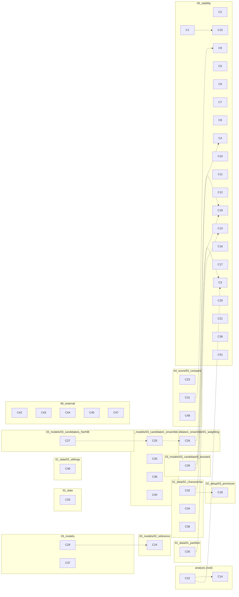

[overview](README.md) / **claims**

# The claim collection

> **A snapshot, generated 2026-09-27 from the tree at commit `3d89200`.** Everything here is derived from files the repository versions and regenerates in seconds with `.venv/bin/python AI-internal/useful-scripts/build_claim_tree_md.py` (or `/hierarchical-report`). If the tree has changed since that commit, rebuild rather than trust this copy; never hand-edit.

Every statement the analysis supports — 48 of them — each bound to the node it rests on and the result files grounding it. Generated from [`Human-AI-collaboration/claims/claims.md`](../../Human-AI-collaboration/claims/claims.md), the collection the manuscript is written from.

## Map

Each box is a node of the tree, holding the claims that rest on it. A dotted arrow is one claim citing another.

## By node

| Node | Claims |
|---|---|
| [`analysis`](analysis/README.md) | [C14](#c14), [C22](#c22) |
| [`analysis/01_data`](analysis/01_data/README.md) | [C33](#c33) |
| [`analysis/01_data/01_partition`](analysis/01_data/01_partition/README.md) | [C35](#c35) |
| [`analysis/01_data/02_characterise`](analysis/01_data/02_characterise/README.md) | [C32](#c32), [C34](#c34), [C36](#c36) |
| [`analysis/01_data/03_siblings`](analysis/01_data/03_siblings/README.md) | [C46](#c46) |
| [`analysis/02_setup/03_provinces`](analysis/02_setup/03_provinces/README.md) | [C18](#c18) |
| [`analysis/03_models`](analysis/03_models/README.md) | [C29](#c29), [C37](#c37) |
| [`analysis/03_models/02_reference`](analysis/03_models/02_reference/README.md) | [C24](#c24) |
| [`analysis/03_models/03_candidate/a_hierNB`](analysis/03_models/03_candidate/a_hierNB/README.md) | [C27](#c27) |
| [`analysis/03_models/03_candidate/b_boosted`](analysis/03_models/03_candidate/b_boosted/README.md) | [C28](#c28) |
| [`analysis/03_models/03_candidate/c_ensemble`](analysis/03_models/03_candidate/c_ensemble/README.md) | [C25](#c25), [C30](#c30), [C38](#c38), [C40](#c40) |
| [`analysis/03_models/03_candidate/c_ensemble/01_weighting`](analysis/03_models/03_candidate/c_ensemble/01_weighting/README.md) | [C26](#c26) |
| [`analysis/04_score/03_compare`](analysis/04_score/03_compare/README.md) | [C23](#c23), [C31](#c31), [C48](#c48) |
| [`analysis/05_stability`](analysis/05_stability/README.md) | [C1](#c1), [C2](#c2), [C3](#c3), [C4](#c4), [C5](#c5), [C6](#c6), [C7](#c7), [C8](#c8), [C9](#c9), [C10](#c10), [C11](#c11), [C12](#c12), [C13](#c13), [C15](#c15), [C16](#c16), [C17](#c17), [C19](#c19), [C20](#c20), [C21](#c21), [C39](#c39), [C41](#c41) |
| [`analysis/06_external`](analysis/06_external/README.md) | [C42](#c42), [C43](#c43), [C44](#c44), [C45](#c45), [C47](#c47) |

## C1

The conclusion this project reports is one member of a distribution over thirty-two analyses that all looked reasonable, fixed before any of them ran. The reported skill score against the reference model is +0.1485; across the set it runs from -0.0724 to +0.2320, with a median of +0.1469, and the reported analysis sits thirteenth of thirty-two.

- **Node:** [`analysis/05_stability`](analysis/05_stability/README.md)
- **Grounds:** [`distribution.json`](../../analysis/05_stability/results/distribution.json) · [`distribution_rows.csv`](../../analysis/05_stability/results/distribution_rows.csv)
- **Scope:** the development backtest, 1998-01 to 2009-12, eight splits; the holdout half of this set ran in batch 16 and is [C15](#c15)
- **Alternatives:** reporting the main path alone with a robustness footnote, which would have hidden that twelve reasonable analyses conclude a better score and nineteen a worse one
- **By:** agent-autonomous

## C2

Our model beats the reference model on 27 of the 32 analyses and both required baselines on 27, and the failures are structured rather than scattered. The five analyses where the reference wins are exactly the five that replace our model or refit its weights; the five where a required baseline wins are exactly the five that weight the headline mean by cases.

- **Node:** [`analysis/05_stability`](analysis/05_stability/README.md)
- **Grounds:** [`distribution.json`](../../analysis/05_stability/results/distribution.json) · [`distribution_rows.csv`](../../analysis/05_stability/results/distribution_rows.csv)
- **Scope:** development; no choice about the data, the evaluation, the scoring or the baselines takes our model below the reference on any row
- **By:** agent-autonomous

## C3

The choice of model family is what the conclusion is sensitive to, and the choices made inside a family are not. Swapping the reported linear opinion pool for candidate 1 costs 0.2209 of skill and for candidate 2 0.0884, while the eight forks inside those two families move it by at most 0.0081, and the eleven combinations they perturb span 18.638 to 18.933 mean CRPS -- a range of 0.295 against the reference model's own 0.565 re-run spread.

- **Node:** [`analysis/05_stability`](analysis/05_stability/README.md)
- **Grounds:** [`sensitivity_by_fork.csv`](../../analysis/05_stability/results/sensitivity_by_fork.csv) · [`fig_fork_sensitivity.csv`](../../analysis/05_stability/results/fig_fork_sensitivity.csv)
- **Scope:** development; the exception is the pool's own weighting fork, which is not inside a member and is worth 0.1820. The 0.565 re-run spread this is compared against is one draw of four repeats of an unseeded model: batch 18's clean-room run drew 0.449 and batch 25's drew 1.167, so the comparator is known only to an order of magnitude and the 0.295 range is inside every draw of it
- **Alternatives:** phase C selected among those eight forks over three batches, on differences this evaluation cannot resolve
- **By:** agent-autonomous

## C4

Six of the tree's seventeen judgment calls move the reported conclusion further than the reference model moves on its own, and eleven do not. The yardstick is measured rather than chosen: the reference is unseeded and was scored four times, and our model's skill score against those four repeats spans 0.0218. Above that band sit the model family (0.2209), the pool's weighting (0.1820), the weighting of the headline mean (0.0835), the province filter (0.0376), the persistence construction (0.0279) and the training window (0.0219, which is the band itself).

- **Node:** [`analysis/05_stability`](analysis/05_stability/README.md)
- **Grounds:** [`sensitivity_by_fork.csv`](../../analysis/05_stability/results/sensitivity_by_fork.csv) · [`distribution.json`](../../analysis/05_stability/results/distribution.json)
- **Scope:** development; a fork whose largest move is inside the band has not been shown to move the conclusion, which is weaker than showing that it does not. **The count is contingent on the band, and the band is a draw**: it is a max minus a min over four repeats of an unseeded model, and batch 25's clean-room run re-drew it at 0.0431, on which the same file reads three of seventeen rather than six. The three that cross -- training window, province filter, persistence construction -- do not move between the draws; the band does. Only the model family, the pool's weighting and the headline-mean weighting are above it on both. How this should be reported is carried to the human (plan §4b, 2026-09-02)
- **Alternatives:** a fixed threshold for what counts as a move, rejected because it would be a silent judgment call inside the node whose job is to make judgment calls visible
- **By:** agent-autonomous

## C5

The cheapest analysis in the perturbation manifest is the one the conclusion is most sensitive to among the choices that leave our model alone. Re-weighting the headline mean re-runs no model at all -- thirteen seconds against twenty minutes -- and moves the reported skill by 0.0835, four times as far as any of the five setup forks that re-run every model on the leaderboard.

- **Node:** [`analysis/05_stability`](analysis/05_stability/README.md)
- **Grounds:** [`sensitivity_by_fork.csv`](../../analysis/05_stability/results/sensitivity_by_fork.csv) · [`manifest.csv`](../../analysis/05_stability/results/manifest.csv)
- **Scope:** development; the mean is over sixteen provinces whose burdens differ by four orders of magnitude, which is why the weighting has this much leverage
- **By:** agent-autonomous

## C6

Under case weighting a required baseline beats the model this project reports, and it does so in every combination where case weighting appears -- five of the thirty-two analyses, all five case-weighted. The pool is too wide on the quiet months and too narrow on the outbreak months, which no single weighting of the mean shows on its own.

- **Node:** [`analysis/05_stability`](analysis/05_stability/README.md)
- **Grounds:** [`distribution.json`](../../analysis/05_stability/results/distribution.json) · [`distribution_rows.csv`](../../analysis/05_stability/results/distribution_rows.csv)
- **Scope:** development; the persistence baseline is the winner in those five rows, and it is the construction batch 6 rejected in one of them
- **By:** agent-autonomous

## C7

Fork effects do not compose, so a one-at-a-time stability report cannot be added up. Across the eight pairs the interaction runs from -0.1033 to +0.0424, and the extreme is larger than either main effect behind it: dropping the two provinces with no evaluable cell is worth +0.0376 alone and weighting the mean by cases +0.0835 alone, and together they come to +0.0177 against an additive +0.1211, because both work by re-weighting what the mean is over.

- **Node:** [`analysis/05_stability`](analysis/05_stability/README.md)
- **Grounds:** [`fig_pair_interaction.csv`](../../analysis/05_stability/results/fig_pair_interaction.csv) · [`conclusions.csv`](../../analysis/05_stability/results/conclusions.csv)
- **Scope:** development; eight pairs selected by a rule fixed and hashed before tier 1 ran, not chosen after seeing tier 1
- **Alternatives:** cutting tier 2 for budget, which was the manifest's first cut and was not taken; on this evidence it would have removed the finding
- **By:** agent-autonomous

## C8

Calibration moves much further across the perturbation set than the score does. Interval coverage at 10-90 runs from 0.458 to 0.920 against a nominal 0.80 while the skill score stays positive on 27 of the 32 analyses, and both extremes involve a re-weighted mean. The rule that a badly calibrated CRPS winner has not won therefore bites hardest exactly where the CRPS looks best.

- **Node:** [`analysis/05_stability`](analysis/05_stability/README.md)
- **Grounds:** [`distribution.json`](../../analysis/05_stability/results/distribution.json) · [`distribution_rows.csv`](../../analysis/05_stability/results/distribution_rows.csv)
- **Scope:** development; coverage is averaged over provinces, which cannot see an interval far too wide in one and far too narrow in another
- **By:** agent-autonomous

## C9

The reported analysis stands on the worse of two published constructions of a baseline the plan requires, and the model it reports is better off for that. Wrapping the persistence point in a fitted negative binomial scores 20.698 mean CRPS against the main path's 24.879 and beats the reference model at 22.098; with that sharper member in the pool, the pool's margin over its own best member falls from 1.954 to 1.264 CRPS. It was not promoted, because phase C was closed and the manifest frozen before the row ran.

- **Node:** [`analysis/05_stability`](analysis/05_stability/README.md)
- **Grounds:** [`conclusions.csv`](../../analysis/05_stability/results/conclusions.csv) · [`sensitivity_by_fork.csv`](../../analysis/05_stability/results/sensitivity_by_fork.csv)
- **Scope:** development; the fork moves the reported conclusion by -0.0279 of skill, the largest downward move of any single row
- **Alternatives:** promoting the sharper construction onto the main path, which the freeze forbids and which would have made the reported pool weaker relative to its members
- **By:** agent-autonomous

## C10

Compute was not the constraint on the stability work and was not close to it. The whole development manifest -- twenty-four one-at-a-time analyses and eight pairs -- ran in 3.66 hours against a 12-hour budget, nothing was cut, and most of the time was the reference model's four unseeded repeats running through an amd64 image under emulation for the one model the plan forbids perturbing. What bound the work was implementation effort: nine of the twenty-four alternatives were sentences in a claim file rather than paths in the tree when the manifest was planned.

- **Node:** [`analysis/05_stability`](analysis/05_stability/README.md)
- **Grounds:** [`cost_planned_vs_actual.json`](../../analysis/05_stability/results/cost_planned_vs_actual.json) · [`run_status.csv`](../../analysis/05_stability/results/run_status.csv) · [`manifest_notes.json`](../../analysis/05_stability/results/manifest_notes.json)
- **Scope:** the machine this project runs on, Darwin arm64, with the reference under emulation
- **By:** agent-autonomous

## C11

A cost model that predicts the total to within a per cent can be uninformative about every individual row. Over the whole manifest the planned total is 7469 seconds against an actual 7469, a ratio of 1.00, while per-row ratios run from 0.51 to 1.91 -- because the model summed each row's parts as measured under the main path and could not know that a row changes how much work a part does. The manifest's cut order is ranked on those estimates, so it carries no information; nothing was cut, so nothing rests on it.

- **Node:** [`analysis/05_stability`](analysis/05_stability/README.md)
- **Grounds:** [`cost_planned_vs_actual.json`](../../analysis/05_stability/results/cost_planned_vs_actual.json) · [`cost_planned_vs_actual.csv`](../../analysis/05_stability/results/cost_planned_vs_actual.csv)
- **Scope:** the twenty-three rows the frozen manifest costed; the comparison reads the manifest through git at the commit that froze it
- **By:** agent-autonomous

## C12

The set of analyses to be run on the held-out year is fixed before the year is opened: thirty-three rows, each the development row under a holdout name, with the development conclusion it is to be reported beside carried row by row. Freezing the set but assembling the development half of the comparison afterwards would leave the comparison selectable after the fact even though neither half was.

- **Node:** [`analysis/05_stability`](analysis/05_stability/README.md)
- **Grounds:** [`manifest_holdout.csv`](../../analysis/05_stability/results/manifest_holdout.csv) · [`holdout_freeze.json`](../../analysis/05_stability/results/holdout_freeze.json)
- **Scope:** the plan's non-negotiable 3 requires the freeze; what is in it is the agent's
- **Alternatives:** freezing only tier 1 and running the pairs on the holdout if budget allowed, rejected because development has already shown the forks do not compose
- **By:** agent-on-human-assessment

## C13

The held-out year was opened once, and the set of analyses evaluated on it was fixed before it was opened. Thirty-two rows -- every row of the development set that has a conclusion -- ran on 2010 through the same scripts their development twins ran, none failed, and each row's development conclusion was frozen into the manifest beside it so the pairing could not be assembled after the seal came off.

- **Node:** [`analysis/05_stability`](analysis/05_stability/README.md)
- **Grounds:** [`manifest_holdout.csv`](../../analysis/05_stability/results/manifest_holdout.csv) · [`holdout_freeze.json`](../../analysis/05_stability/results/holdout_freeze.json) · [`run_status_holdout.csv`](../../analysis/05_stability/results/run_status_holdout.csv) · [`phase_e_opening.json`](../../analysis/01_data/01_partition/results/phase_e_opening.json)
- **Scope:** the manifest was committed at 937fd5c and the first file under analysis/results/*__holdout/ appears at 895a9f8, which is the evidence that the set predates the opening
- **Alternatives:** freezing which analyses run and assembling the development half of the comparison afterwards, which would have left the comparison selectable even though neither half was
- **By:** agent-autonomous

## C14

The reported model beats the reference model and both required baselines on the held-out year as well as on the development period, at a skill score of +0.0868 against +0.1485. The gap between the two is -0.0617, and it is a gap in a ratio rather than in a raw score: 2010 was a much harder year, and the reference model, which nobody here tuned, scores 84.026 mean CRPS on it against 22.098 on development.

- **Node:** [`analysis`](analysis/README.md)
- **Grounds:** [`conclusion.json`](../../analysis/results/main__holdout/conclusion.json) · [`conclusion.json`](../../analysis/results/main/conclusion.json) · [`holdout_vs_development.json`](../../analysis/05_stability/results/holdout_vs_development.json)
- **Scope:** four splits over 2010-01 to 2010-12, 192 cells in 16 provinces, against eight splits and 371 cells on development; the two raw CRPS figures are not comparable and the skill scores are
- **Alternatives:** reporting the raw CRPS gap, which would have confounded a model that flattered itself on development with 2010 simply being harder
- **By:** agent-autonomous

## C15

The distribution of conclusions over the frozen set is more than twice as wide on the held-out year as on the development period: -0.5038 to +0.2026 against -0.0724 to +0.2320. Six of the thirty-two analyses fall below zero on 2010, where none did on development, and the reported analysis moves from thirteenth of thirty-two to eighteenth.

- **Node:** [`analysis/05_stability`](analysis/05_stability/README.md)
- **Grounds:** [`holdout_distribution.json`](../../analysis/05_stability/results/holdout_distribution.json) · [`distribution.json`](../../analysis/05_stability/results/distribution.json) · [`holdout_vs_development.json`](../../analysis/05_stability/results/holdout_vs_development.json)
- **Scope:** the same thirty-two analyses on both datasets; each dataset's noise band is measured on that dataset, 0.0218 on development and 0.0140 on the holdout
- **By:** agent-autonomous

## C16

Twenty-eight of the thirty-two analyses scored worse on the year they had not seen, with a median drop of 0.056 in skill. The four that scored better were all analyses that had been below the reference model on development.

- **Node:** [`analysis/05_stability`](analysis/05_stability/README.md)
- **Grounds:** [`holdout_vs_development.csv`](../../analysis/05_stability/results/holdout_vs_development.csv) · [`holdout_vs_development.json`](../../analysis/05_stability/results/holdout_vs_development.json) · [`fig_holdout_vs_development.csv`](../../analysis/05_stability/results/fig_holdout_vs_development.csv)
- **Scope:** skill scores, so each is already relative to a reference model that faced the same year
- **By:** agent-autonomous

## C17

Ranking these analyses on the development set is a weak guide to how they rank on a year they have not seen. The Spearman rank correlation between the development and holdout skill scores across the thirty-two is +0.396. The ranking of the judgment calls transfers better, at +0.679, with fourteen of seventeen forks agreeing on whether they move the conclusion beyond their own dataset's noise band.

- **Node:** [`analysis/05_stability`](analysis/05_stability/README.md)
- **Grounds:** [`holdout_vs_development.json`](../../analysis/05_stability/results/holdout_vs_development.json) · [`fork_sensitivity_both.csv`](../../analysis/05_stability/results/fork_sensitivity_both.csv)
- **Scope:** thirty-two analyses and seventeen forks; the three forks that disagree are the pool's weighting and the persistence construction, which matter on development only, and the hierarchical model's covariate set, which matters on 2010 only
- **By:** agent-autonomous

## C18

The analysis the development set ranked highest among those that change the data or the models is twenty-ninth of thirty-two on the held-out year, and the fork behind it moved the reference model rather than ours. Removing the two provinces that contribute no evaluable cell before the platform sees them takes the reported skill from +0.1485 to +0.1861 on development and to -0.1828 on 2010; across that change our pool moves from 76.73 to 76.56 mean CRPS, inside the noise, while the reference model moves from 84.03 to 64.72.

- **Node:** [`analysis/02_setup/03_provinces`](analysis/02_setup/03_provinces/README.md)
- **Grounds:** [`conclusion.json`](../../analysis/results/provinces_reportingOnly__holdout/conclusion.json) · [`conclusion.json`](../../analysis/results/provinces_reportingOnly/conclusion.json) · [`conclusion.json`](../../analysis/results/main__holdout/conclusion.json) · [`holdout_vs_development.csv`](../../analysis/05_stability/results/holdout_vs_development.csv)
- **Scope:** the same sixteen provinces and 192 cells are scored either way; what the fork changes is what every model is fitted on, not what the metric averages over. The row ranks fourth of thirty-two on development and twenty-ninth on the holdout; the three development rows above it all re-weight the headline mean, and its own case-weighted pair is the worst of all thirty-two on 2010
- **Alternatives:** reading the row as evidence that our model is sensitive to the province filter, which the per-model CRPS shows it is not
- **By:** agent-autonomous

## C19

The province filter is the largest single judgment call in the project on the held-out year, at 0.2696 of skill, having been fourth at 0.0376 on development. Over the same change the model family halves, from 0.2209 to 0.0949, and the pool's own weighting fork collapses from 0.1820 to 0.0121 and falls below the noise band.

- **Node:** [`analysis/05_stability`](analysis/05_stability/README.md)
- **Grounds:** [`fork_sensitivity_both.csv`](../../analysis/05_stability/results/fork_sensitivity_both.csv) · [`holdout_sensitivity_by_fork.csv`](../../analysis/05_stability/results/holdout_sensitivity_by_fork.csv) · [`fig_fork_sensitivity_both.csv`](../../analysis/05_stability/results/fig_fork_sensitivity_both.csv)
- **Scope:** each dataset's band measured on that dataset; five forks clear the holdout's band against six on development
- **By:** agent-autonomous

## C20

The reported model's over-dispersion on development does not survive the change of year. Its 10-90 interval coverage is 0.863 against a nominal 0.80 on the development backtest, the widest in the project, and 0.755 on the held-out year; across the frozen set coverage runs 0.458 to 0.920 on development and 0.210 to 0.854 on 2010.

- **Node:** [`analysis/05_stability`](analysis/05_stability/README.md)
- **Grounds:** [`holdout_distribution.json`](../../analysis/05_stability/results/holdout_distribution.json) · [`distribution.json`](../../analysis/05_stability/results/distribution.json) · [`conclusion.json`](../../analysis/results/main__holdout/conclusion.json)
- **Scope:** 10-90 nominal 0.80; calibration is reported beside the score because a badly calibrated CRPS winner has not won
- **By:** agent-autonomous

## C21

The forks do not compose on the held-out year either. Across the eight frozen pairs the largest interaction is -0.2876, on the same row that carries the largest single move, and it is larger than either main effect behind it.

- **Node:** [`analysis/05_stability`](analysis/05_stability/README.md)
- **Grounds:** [`holdout_distribution.json`](../../analysis/05_stability/results/holdout_distribution.json) · [`holdout_conclusions.csv`](../../analysis/05_stability/results/holdout_conclusions.csv)
- **Scope:** eight pairs selected by a rule fixed and hashed before tier 1 ran; the development set's largest interaction was -0.1033
- **By:** agent-autonomous

## C22

On the development backtest the model this project reports beats the reference model and both required baselines: mean CRPS 18.817 against the reference's 22.098, a skill score of +0.1485, and the lower CRPS in six of the eight splits. The model is a linear opinion pool over two candidate families and the two required baselines.

- **Node:** [`analysis`](analysis/README.md)
- **Grounds:** [`conclusion.json`](../../analysis/results/main/conclusion.json) · [`leaderboard.csv`](../../analysis/04_score/03_compare/results/main/leaderboard.csv)
- **Scope:** 371 evaluated cells in 16 provinces over eight splits, 2008-01 to 2009-12, from a training set ending 2007-12; the same model on the held-out year is [C14](#c14)
- **Alternatives:** the eleven configuration forks inside the two member families move this score by at most 0.0081 of skill ([C3](#c3)), so it is not sensitive to how the members were configured
- **By:** agent-autonomous

## C23

The margin is not large enough to separate the two models. The paired difference is 3.282 CRPS per cell against a split-clustered standard error of 1.726 -- 1.90 standard errors -- and our model has the lower mean while winning only 43.1 % of the individual cells. This is the largest margin the project produced against the reference, and a comparison at this resolution still cannot say the two models differ.

- **Node:** [`analysis/04_score/03_compare`](analysis/04_score/03_compare/README.md)
- **Grounds:** [`comparison_notes.json`](../../analysis/04_score/03_compare/results/main/comparison_notes.json) · [`paired_summary.csv`](../../analysis/04_score/03_compare/results/main/paired_summary.csv)
- **Scope:** development; the standard error is clustered at the split, which is the level the eight numbers are exchangeable at. The 1.90 is the quotient of the two stored figures beside it and is not itself stored: a claim may state something that follows trivially from the figures it cites -- a ratio, a ranking -- and may not state anything that needed a step nobody ran (human-set, 2026-08-31)
- **Alternatives:** the naive per-cell standard error is 0.948 and would have made the margin look nearly twice as decisive; it assumes 371 independent cells, which a panel of 16 provinces over eight quarters is not
- **By:** agent-on-human-assessment

## C24

The reference model cannot be seeded, and its own re-run spread is the floor on what this backtest can attribute to a model at all. Four repeats score 21.820, 21.917, 22.272 and 22.385 mean CRPS, and the largest paired difference between two of them is 0.565 CRPS. Anything smaller than that belongs to the reference's sampler rather than to any model.

- **Node:** [`analysis/03_models/02_reference`](analysis/03_models/02_reference/README.md)
- **Grounds:** [`reference_repeat_noise.csv`](../../analysis/04_score/03_compare/results/main/reference_repeat_noise.csv) · [`model_spec.json`](../../analysis/03_models/02_reference/results/main/model_spec.json) · [`comparison_notes.json`](../../analysis/04_score/03_compare/results/main/comparison_notes.json)
- **Scope:** development; the reported reference figure is the per-cell mean of the four repeats, so no reported ratio divides by a single draw
- **Alternatives:** running the reference once, which is what batch 4's reconnaissance figure of 21.9 was, and which would have put an unmeasured share of the sampler's noise into every number reported against it
- **By:** agent-autonomous

## C25

Pooling beats every model that goes into it. The pool scores 18.817 mean CRPS against its best member's 20.771 and the mean of its members' 23.421, with half its weight on the two required baselines, which are the two worst-scoring models in the comparison. The premise registered before the run -- that a pool would land between the best member and the members' mean -- is wrong: it beat the best member by 1.954 CRPS. The half of that premise about spread holds, and the pool over-covers because of it.

- **Node:** [`analysis/03_models/03_candidate/c_ensemble`](analysis/03_models/03_candidate/c_ensemble/README.md)
- **Grounds:** [`pool_check.json`](../../analysis/03_models/03_candidate/c_ensemble/results/main/pool_check.json) · [`conclusion.json`](../../analysis/results/main/conclusion.json)
- **Scope:** development, equal weights over four members
- **Alternatives:** a pool over the two candidate families only, which was not built; what the manifest perturbs instead is the weighting ([C26](#c26)) and each member's own configuration
- **By:** agent-autonomous

## C26

Fitting the pool's weights costs far more than it buys. Weights chosen by minimising the pool's CRPS on a validation period held back inside the training frame score 22.838 mean CRPS against equal weights' 18.817 -- 4.021 CRPS worse, and enough to lose to the reference model that equal weighting beats.

- **Node:** [`analysis/03_models/03_candidate/c_ensemble/01_weighting`](analysis/03_models/03_candidate/c_ensemble/01_weighting/README.md)
- **Grounds:** [`conclusion.json`](../../analysis/results/weighting_crpsWeighted/conclusion.json) · [`conclusion.json`](../../analysis/results/main/conclusion.json)
- **Scope:** development; the same fork is worth 0.1820 of skill there and collapses to 0.0121 on the held-out year, below that year's noise band ([C19](#c19))
- **Alternatives:** equal weighting, which is the main path and the reported model
- **By:** agent-autonomous

## C27

The model family the project built first never beat the reference model. The hierarchical negative-binomial GLM scores 23.698 mean CRPS against 22.098, a skill score of -0.0724, and it is the lowest of the thirty-two analyses in the development distribution. It does beat both required baselines, and it stays in the reported model as a pool member.

- **Node:** [`analysis/03_models/03_candidate/a_hierNB`](analysis/03_models/03_candidate/a_hierNB/README.md)
- **Grounds:** [`conclusion.json`](../../analysis/results/family_hierNB/conclusion.json) · [`distribution_rows.csv`](../../analysis/05_stability/results/distribution_rows.csv)
- **Scope:** development, at the configuration batch 9 promoted after sweeping its six forks over two rounds
- **Alternatives:** dropping the family once candidate 2 beat it, which would have removed a member the pool is measurably better with ([C25](#c25))
- **By:** agent-autonomous

## C28

The second family beat the reference model on its own, before any pooling. Gradient-boosted trees with a probabilistic head score 20.771 mean CRPS against 22.098, a skill score of +0.0601, at 10-90 interval coverage of 0.825 against a nominal 0.80 -- the closest to nominal of any single model of ours.

- **Node:** [`analysis/03_models/03_candidate/b_boosted`](analysis/03_models/03_candidate/b_boosted/README.md)
- **Grounds:** [`conclusion.json`](../../analysis/results/family_boosted/conclusion.json) · [`leaderboard.csv`](../../analysis/04_score/03_compare/results/main/leaderboard.csv)
- **Scope:** development; neither of its two forks moves it beyond the noise band ([C3](#c3), [C4](#c4))
- **By:** agent-autonomous

## C29

The reported model is cheaper to run than the model it beats. One eight-split evaluation of the pool takes 59.5 seconds natively; one repeat of the reference takes between 241 and 285 seconds through an amd64 image under emulation, and the reported reference figure needs four of them, at 1 070 seconds.

- **Node:** [`analysis/03_models`](analysis/03_models/README.md)
- **Grounds:** [`run_cost.json`](../../analysis/03_models/03_candidate/c_ensemble/results/main/run_cost.json) · [`run_cost.json`](../../analysis/03_models/02_reference/results/main/run_cost.json)
- **Scope:** this machine, Darwin arm64; the emulation penalty is a property of the host, not of the reference model, and the repeats are needed because it is unseeded ([C24](#c24))
- **By:** agent-autonomous

## C30

On this dataset the 25-75 coverage figures are not a clean reading of calibration and the 10-90 figures are. 56 % of observed province-months are exactly zero, and at 24 % to 55 % of evaluated cells a member's 25-75 quantiles coincide, so its interval is the single point zero and every zero outcome falls inside it whatever the model believes. At 10-90 that share is under 27 % for the members and 0.3 % for the pool.

- **Node:** [`analysis/03_models/03_candidate/c_ensemble`](analysis/03_models/03_candidate/c_ensemble/README.md)
- **Grounds:** [`pool_check.json`](../../analysis/03_models/03_candidate/c_ensemble/results/main/pool_check.json) · [`dev_overview.json`](../../analysis/01_data/02_characterise/results/dev_overview.json)
- **Scope:** development; every coverage figure this project reports beside a score is the 10-90 one
- **By:** agent-autonomous

## C31

Both required baselines lose to the reference model, so beating the baselines is not the bar that binds. Persistence scores 24.879 and seasonal climatology 24.337 against the reference's 22.098, skill scores of -0.126 and -0.101. The reference is the harder bar by about 2.5 CRPS, and it is the one every reported ratio is taken against.

- **Node:** [`analysis/04_score/03_compare`](analysis/04_score/03_compare/README.md)
- **Grounds:** [`leaderboard.csv`](../../analysis/04_score/03_compare/results/main/leaderboard.csv) · [`conclusion.json`](../../analysis/results/main/conclusion.json)
- **Scope:** development, at the baselines' main-path constructions; the alternative persistence construction does beat the reference ([C9](#c9))
- **By:** agent-autonomous

## C32

The headline mean is over 16 provinces and 371 cells, not the 18 provinces the file contains. Chap's own region filter rejects Vientiane province, which reports nothing anywhere in the record, and keeps Xaisomboun, which stops reporting after 2005 and contributes no evaluable cell to the evaluated span; Phongsaly contributes 11 cells of a possible 24. Of the 408 province-months in the span, 371 are scored.

- **Node:** [`analysis/01_data/02_characterise`](analysis/01_data/02_characterise/README.md)
- **Grounds:** [`backtest_scheme_chosen.json`](../../analysis/01_data/02_characterise/results/backtest_scheme_chosen.json) · [`evaluable_cells_by_province.csv`](../../analysis/01_data/02_characterise/results/evaluable_cells_by_province.csv)
- **Scope:** development; the held-out year is 192 cells in the same 16 provinces over four splits
- **Alternatives:** removing the silent provinces before the platform sees them, or folding Vientiane into the capital; both are alternatives nodes rather than a silent cleaning step, and the first turns out to be the largest judgment call in the project on the held-out year ([C18](#c18), [C19](#c19))
- **By:** agent-autonomous

## C33

Three statements in the dataset's own schema do not describe the file it ships with. The schema states 2 575 rows where the file carries 2 808 -- the stated figure is the count of rows whose target is not null. It declares rainfall as a monthly total in millimetres, which would put a province's whole year at a few tens of millimetres; read as a mean daily rate the same column puts the year in the thousands, a factor of 30.4 apart, and the second reading is the one the file supports. And the population column, declared against a 2020 reference, sums to 4.96 million where the national total that year was 7.35 million, matching the country around 1995.

- **Node:** [`analysis/01_data`](analysis/01_data/README.md)
- **Grounds:** [`rowcount_reconciliation.json`](../../analysis/01_data/01_partition/results/rowcount_reconciliation.json) · [`covariate_units_check.json`](../../analysis/01_data/02_characterise/results/covariate_units_check.json) · [`setup_spec.json`](../../analysis/02_setup/01_population/b_backCast/results/popColumn_backCast/setup_spec.json)
- **Scope:** nothing downstream turns on the rainfall reading, because every model sees a monotone transform of the same column; anything importing an external rainfall threshold would be wrong by about thirty
- **Alternatives:** taking the schema at its word, which is what a pipeline reading the metadata rather than the data would do
- **By:** agent-autonomous

## C34

The target is mostly zeros, and the record gets less complete as it goes on. Of the 2 383 observed province-months in the development period 56.3 % are exactly zero and a further 8.1 % of the grid is missing; reporting completeness holds at 94.4 % through 2005 and falls to 83.3 % by 2008, so the evaluated span is the least complete part of the record.

- **Node:** [`analysis/01_data/02_characterise`](analysis/01_data/02_characterise/README.md)
- **Grounds:** [`dev_overview.json`](../../analysis/01_data/02_characterise/results/dev_overview.json) · [`cases_by_year.csv`](../../analysis/01_data/02_characterise/results/cases_by_year.csv) · [`zero_structure.csv`](../../analysis/01_data/02_characterise/results/zero_structure.csv)
- **Scope:** the development period, 1998-01 to 2009-12; the holdout was not characterised
- **By:** agent-autonomous

## C35

The development file and the sealed holdout partition the archived source exactly, and this was verified rather than assumed: 2 592 and 216 lines against the source's 2 808, no line in both, and the sorted union byte-identical to the source under sha256. The check runs again on every run of the analysis, against the archive's own checksum manifest.

- **Node:** [`analysis/01_data/01_partition`](analysis/01_data/01_partition/README.md)
- **Grounds:** [`partition_check.json`](../../analysis/01_data/01_partition/results/partition_check.json) · [`partition_outputs.sha256`](../../analysis/01_data/01_partition/results/partition_outputs.sha256)
- **Scope:** this is what made batch 16's reassembly of the full file legitimate rather than a second import of the data ([C13](#c13))
- **By:** agent-autonomous

## C36

The evaluation scheme was fixed before any model ran and never moved: three-month horizons, eight splits, stride three, retrained once, evaluating 2008-01 to 2009-12 from a training set ending 2007-12. The schedule was read out of chap-core's own splitter rather than reimplemented, and the phase-E arrangement -- same horizon and stride, four splits -- evaluates exactly 2010 from training that never reaches into it.

- **Node:** [`analysis/01_data/02_characterise`](analysis/01_data/02_characterise/README.md)
- **Grounds:** [`split_schedule.csv`](../../analysis/01_data/02_characterise/results/split_schedule.csv) · [`backtest_scheme_chosen.json`](../../analysis/01_data/02_characterise/results/backtest_scheme_chosen.json)
- **Scope:** fixed in batch 3; a horizon changed midway would make every earlier number incomparable
- **Alternatives:** the schemes considered and rejected are kept, with their span and split counts, in backtest_scheme_candidates.csv beside the chosen one
- **By:** agent-autonomous

## C37

Every model this project wrote reproduces byte-identically when it is run again -- per-cell scores, model listing and fitted object, for all seven of them. The reference model cannot be made to do this: it calls its sampler without ever setting a seed and the service exposes no seed, so its variability is quantified by repetition instead of removed.

- **Node:** [`analysis/03_models`](analysis/03_models/README.md)
- **Grounds:** [`model_determinism.json`](../../AI-generated/determinism-checks/model_determinism.json) · [`model_spec.json`](../../analysis/03_models/02_reference/results/main/model_spec.json)
- **Scope:** the evaluation NetCDF is excluded from the comparison because chap-core stamps a creation date into it; everything computed from it is compared
- **Alternatives:** making the check a node inside the tree, so that every run re-verified determinism; rejected because it would double the cost of every model run to re-establish something that changes only when a model changes
- **By:** agent-autonomous

## C38

The pool holds no model code of its own, and that is checkable rather than asserted. Each member runs through its own Chap entry points, read out of that member's own contract directory with every file's hash recorded; and the pool rebuilt independently from its members' stored evaluations scores 18.801 against the 18.817 it scored as run, a difference of 0.016 CRPS, which is the sampling error of which draws each member contributed.

- **Node:** [`analysis/03_models/03_candidate/c_ensemble`](analysis/03_models/03_candidate/c_ensemble/README.md)
- **Grounds:** [`pool_check.json`](../../analysis/03_models/03_candidate/c_ensemble/results/main/pool_check.json) · [`members.json`](../../analysis/03_models/03_candidate/c_ensemble/results/main/members.json)
- **Scope:** development, main path; the reconstruction is computed from the members' own stored forecasts and is independent of the ensemble's
- **By:** agent-autonomous

## C39

The cost model was tested as a prediction for the first time on the held-out half and it held at the total: 8 602 seconds actual against 7 468 planned, a ratio of 1.15 over 32 rows, where the development half's 1.00 was measured over runs that had already happened. The worst row is again the one that changes how much work a part does -- refitting at every split, at 1.97 -- so the total being right a second time does not make any individual estimate right, and the cut order those estimates rank still carries no information.

- **Node:** [`analysis/05_stability`](analysis/05_stability/README.md)
- **Grounds:** [`holdout_cost_planned_vs_actual.json`](../../analysis/05_stability/results/holdout_cost_planned_vs_actual.json) · [`cost_planned_vs_actual.json`](../../analysis/05_stability/results/cost_planned_vs_actual.json)
- **Scope:** the 32 phase-E rows, costed by the same model against the same parts and read out of the manifest at the commit that froze it, 937fd5c, before the year was opened
- **Alternatives:** re-costing the phase-E half after seeing the development half's per-row errors, which the freeze forbids and which would have made the comparison a fit rather than a prediction
- **By:** agent-autonomous

## C40

The pool's independent reconstruction reaches the held-out year, and it says the same thing there. Rebuilt from its members' own stored evaluations of 2010 and scored with chap-core's own CRPS, the reported pool gives 76.646 against the 76.731 it scored -- a residual of 0.085 over 192 cells, the same relative size as the 0.016 over 371 development cells. On that year it beats its best member by 4.767 CRPS: seasonal climatology 81.498, candidate 2 81.679, candidate 1 84.707, persistence 128.052. The prediction registered before any of this ran fails on 2010 in both of its halves. That an equally weighted pool would score worse than its best member is false here as it was on development. That its 10-90 coverage would be at least its largest member's held on development and does not hold on the held-out year: 0.755 against candidate 2's 0.854, with the other three members at 0.516, 0.464 and 0.417.

- **Node:** [`analysis/03_models/03_candidate/c_ensemble`](analysis/03_models/03_candidate/c_ensemble/README.md)
- **Grounds:** [`pool_check.json`](../../analysis/03_models/03_candidate/c_ensemble/results/main__holdout/pool_check.json) · [`pool_check.json`](../../analysis/03_models/03_candidate/c_ensemble/results/main/pool_check.json)
- **Scope:** the held-out year, main path, equal weights over four members; the reconstruction is computed from the members' own stored forecasts and is independent of the pool's
- **Alternatives:** until batch 28 this row's file recorded the reconstruction as impossible, which recorded the order the rows were run in and not a property of the analysis
- **By:** agent-autonomous

## C41

The pool's second path is available on eleven of the fifty-one combinations that run it, and the forty it is missing from are missing it for a structural reason rather than an accidental one. The reconstruction compares the pool with its members' own separate evaluations, and this tree evaluates a member on its own only under the family fork's own combination -- so a row that moves a fork inside a member has no separate run of that member under the configuration the pool gave it, and no order of execution would produce one. Across the eleven, the residual between the rebuilt pool and the pool that ran is 0.016 to 0.136 CRPS, largest on the held-out rows where every score is about four times the size.

- **Node:** [`analysis/05_stability`](analysis/05_stability/README.md)
- **Grounds:** [`pool_reconstruction.json`](../../analysis/05_stability/results/pool_reconstruction.json)
- **Scope:** both datasets; every combination whose model is the pool
- **Alternatives:** running each perturbed member on its own as well, which would make the remaining forty reconstructable at the cost of a second evaluation per candidate-internal row and was not in the frozen manifest
- **By:** agent-autonomous

## C42

The development-to-final-year drop measured on Laos replicates on both sibling countries, so it is not about 2010 alone. Run unchanged on the Thai and Vietnamese files of the same harmonisation, on the same months and under the same two schemes, the reported model's skill score against the reference falls from +0.0856 to +0.0197 on Thailand and from +0.0852 to -0.0862 on Vietnam, against Laos's +0.1485 to +0.0868. All three drops -- -0.0659, -0.1714 and -0.0617 -- are larger than the two reference re-run bands they are measured against, taken together.

- **Node:** [`analysis/06_external`](analysis/06_external/README.md)
- **Grounds:** [`external_vs_laos.json`](../../analysis/06_external/results/external_vs_laos.json) · [`external_conclusions.csv`](../../analysis/06_external/results/external_conclusions.csv)
- **Scope:** three countries of one harmonisation, one final year each; this is not a sample and no confidence statement is made from it. No model was developed on the two sibling files, so their final years were not held out from anything -- what replicates is the direction and rough size of the drop, not a held-out result. **The "larger than the two bands together" clause does not survive a re-run and is withdrawn as a general statement.** The clean-room run of 2026-09-05 re-ran the whole analysis from a clean checkout and the clause came back **false for Laos and false for Thailand**, true only for Vietnam. Laos was predicted to be fragile -- it cleared its band sum by 0.0207 against a Lao development band this project has drawn at 0.0218, 0.0431, 0.0349 and 0.0483. **Thailand was not, and failed differently**: its band is the tightest in the project, and what moved was the drop itself, from -0.0659 to -0.0345, because the reference did worse on Thailand's 2010 on that draw. What survives both draws is the direction in all three countries, the ordering, and the sign of the Vietnamese final-year loss; what does not survive is the quantification against the reference's own noise. Stated on the standard the human set on 2026-09-03: a figure measured against a band that is itself a draw is reported with that dependence
- **Alternatives:** running the siblings on their own calendars, which for Thailand would have used twenty-two more years and made the comparison about the years as well as the country
- **By:** agent-autonomous

## C43

The country the model was developed on is the country it scores highest on, and the two it never saw agree with each other almost exactly. On the development arrangement the reported model's skill score is +0.1485 on Laos, +0.0856 on Thailand and +0.0852 on Vietnam: the two siblings differ from each other by 0.0004 and from Laos by 0.063, which is about the size of the whole development-to-final-year drop on Laos.

- **Node:** [`analysis/06_external`](analysis/06_external/README.md)
- **Grounds:** [`external_conclusions.csv`](../../analysis/06_external/results/external_conclusions.csv) · [`fig_external_skill.csv`](../../analysis/06_external/results/fig_external_skill.csv)
- **Scope:** the development arrangement only, 3/8/3 over 2008-01 to 2009-12; the three countries differ in more than whether the model was developed on them -- 16, 76 and 63 provinces, and mean monthly case counts differing by a factor of four -- so the gap is not attributable to development alone, only measured beside it
- **Alternatives:** attributing the whole 0.063 to having developed against Laos, which the design cannot support: nothing here varies development while holding the country fixed
- **By:** agent-autonomous

## C44

What the backtest can resolve is a property of the country rather than of the evaluation. The reference model is unseeded and is scored four times on every dataset; the largest paired difference between two of its repeats is 0.032 CRPS on Thailand's development backtest, 0.565 on Laos's and 7.082 on Vietnam's -- a factor of 219 on one model at one configuration. So Vietnam's +0.0852 margin sits inside the reference's own re-run spread and cannot be attributed to a model at all, while Thailand's near-identical +0.0856 is about thirty-six times its band.

- **Node:** [`analysis/06_external`](analysis/06_external/README.md)
- **Grounds:** [`external_conclusions.csv`](../../analysis/06_external/results/external_conclusions.csv)
- **Scope:** one draw of four repeats per dataset; the band is itself a draw, which is why it is reported per dataset and never carried from one to another
- **Alternatives:** quoting the Lao noise floor of 0.565 CRPS as the project's resolution, which two of the four external datasets contradict in opposite directions
- **By:** agent-autonomous

## C45

The reported model's over-dispersion is not a Lao artefact and gets worse on the sibling countries. Its 10-90 interval coverage against a nominal 0.80 is 0.863 on Lao development, 0.941 on Vietnam's and 0.967 on Thailand's, and 0.755, 0.893 and 0.875 on the three final years. It beats both required baselines on all six analyses and the reference model on five of the six, losing only on Vietnam's final year.

- **Node:** [`analysis/06_external`](analysis/06_external/README.md)
- **Grounds:** [`external_conclusions.csv`](../../analysis/06_external/results/external_conclusions.csv) · [`external_vs_laos.json`](../../analysis/06_external/results/external_vs_laos.json)
- **Scope:** the reported model at its reported configuration; the coverage figures are the platform's own, computed by the same evaluation path on all six
- **By:** agent-autonomous

## C46

Two of the three statements this project found not to describe the Lao dataset describe none of the three files of that harmonisation, so they are the harmonisation's rather than Laos's. rainfall is declared in all three schemas as a monthly total in millimetres and is a mean daily rate in all three; and row_count means different things in different files -- Vietnam declares 9612 against 9828 rows and Laos 2575 against 2808, both counting rows with an observed target, while Thailand declares 27720, which is its row count exactly and 696 more than its complete records. Thailand's population column is also not a static snapshot: all 77 provinces carry an annual series, so the fork this project spent a node arguing over is one the harmonisation answers differently per country.

- **Node:** [`analysis/01_data/03_siblings`](analysis/01_data/03_siblings/README.md)
- **Grounds:** [`schema_reconciliation.json`](../../analysis/01_data/03_siblings/results/schema_reconciliation.json) · [`rowcount_reconciliation.json`](../../analysis/01_data/01_partition/results/rowcount_reconciliation.json) · [`covariate_units_check.json`](../../analysis/01_data/02_characterise/results/covariate_units_check.json)
- **Scope:** the three country folders of dhis2/climate-health-data at commit af362d52; nothing here establishes what other countries in that repository do
- **Alternatives:** reporting the Lao schema's errors as the Lao file's, which two batches did before the siblings were read
- **By:** agent-autonomous

## C47

The cost model's total was wrong on the external check in the direction its two earlier tests were right. Planned 3.14 hours against 1.81 actual, a ratio of 0.58, where phase D's development half came out at 1.00 and its frozen holdout half at 1.15; per row it runs 0.39 to 1.20. The unit is seconds per evaluated cell measured on the Lao holdout, and it does not transfer to datasets four to ten times the size -- so the total being right twice was a property of estimating a set against itself, and the cut order such estimates rank still carries no information.

- **Node:** [`analysis/06_external`](analysis/06_external/README.md)
- **Grounds:** [`external_cost_planned_vs_actual.json`](../../analysis/06_external/results/external_cost_planned_vs_actual.json) · [`external_plan.json`](../../analysis/06_external/results/external_plan.json) · [`holdout_cost_planned_vs_actual.json`](../../analysis/05_stability/results/holdout_cost_planned_vs_actual.json)
- **Scope:** four rows; the estimate was committed before any of them ran, and nothing was cut because 3.14 hours was inside the six-hour budget
- **By:** agent-autonomous

## C48

The margin that the evaluation cannot separate is the usual case rather than the exception, and it applies to the held-out headline this project reports. Measured as the paired per-cell difference over its split-clustered standard error, the reported model stands 1.90 standard errors from the reference on the Lao development backtest, 0.94 on the Lao held-out year, 3.62 and 1.45 on the two sibling development backtests, and 0.97 and 0.49 on the two sibling final years. This project's own line for the case arriving in practice is 1.03, so five of the six analyses are on the wrong side of it -- including the held-out result the project reports as beating the reference, and including the Vietnamese final year it reports as a loss.

- **Node:** [`analysis/04_score/03_compare`](analysis/04_score/03_compare/README.md)
- **Grounds:** [`conclusion.json`](../../analysis/results/main/conclusion.json) · [`conclusion.json`](../../analysis/results/main__holdout/conclusion.json) · [`external_conclusions.csv`](../../analysis/06_external/results/external_conclusions.csv)
- **Scope:** the paired comparison against the reference model only; there is no equivalent paired test against the required baselines anywhere in the project, so beats_all_baselines is a comparison of two means with no spread attached
- **Alternatives:** reporting the six skill scores without their resolution, which is what every summary document in this project did until the outsider check of 2026-09-05 asked for it -- the standard-error yardstick had been applied to exactly one number, the development headline
- **By:** agent-autonomous
